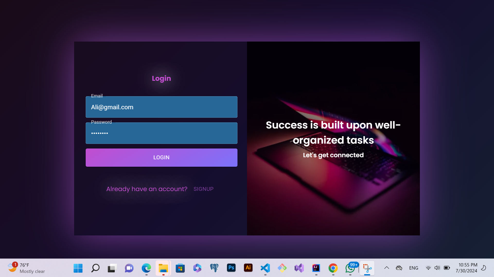
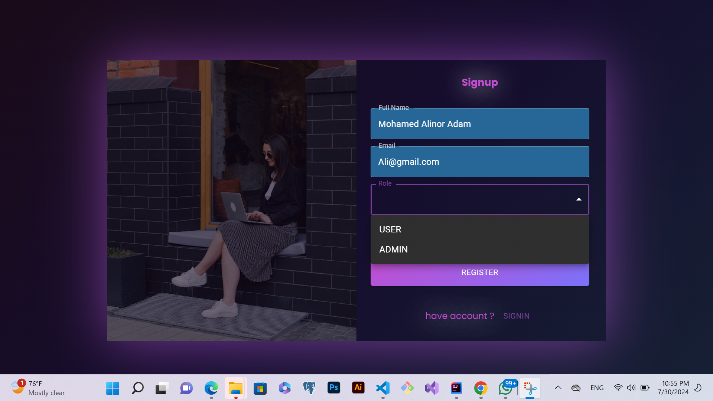
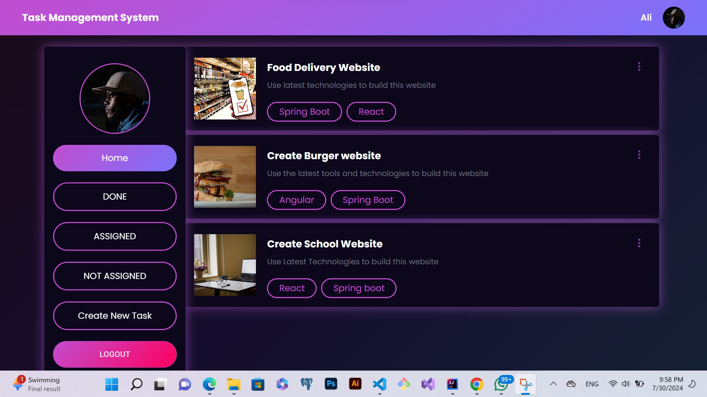

# Task Management System

This project is built with [Create React App](https://github.com/facebook/create-react-app).

## Available Scripts

In the project directory, you can run:

### `npm start`

Runs the app in development mode.\
Open [http://localhost:3000](http://localhost:3000) to view it in your browser. The page will reload when you make changes, and you may see any lint errors in the console.

### `npm test`

Launches the test runner in the interactive watch mode.

### `npm run build`

Builds the app for production to the `build` folder.\
It correctly bundles React in production mode and optimizes the build for the best performance.

### `npm run eject`

**Note: this is a one-way operation. Once you `eject`, you can't go back!** This command will copy all the configuration files and dependencies into your project for full control.

## Deployment

This project is deployed at [Live Project](https://ibnualii.github.io/Task-Management-System/).

## Learn More

To learn more about Create React App, check out the [Create React App documentation](https://facebook.github.io/create-react-app/docs/getting-started).\
To learn React, check out the [React documentation](https://reactjs.org/).

## Screenshots

## Video

Here is a demo video of the project:

